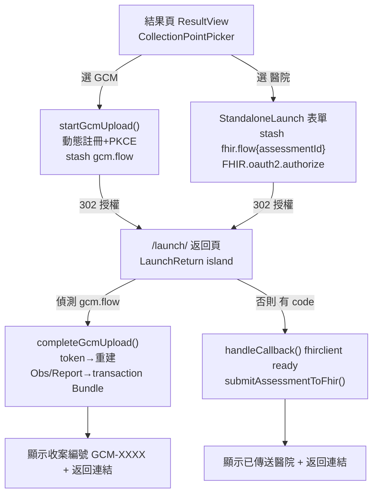

# GCM 收案點整合設計

- **日期**：2026-05-31
- **狀態**：設計定稿（待 review → writing-plans）
- **目標**：受測者本地完成成人 IC 評估後，可在結果頁自選收案點，把結果以標準 SMART on FHIR 上傳。新增 **GCM 預防醫學發展協會**（`https://gcm.fhir.yao.care`）為收案點，與既有「醫院 FHIR Server」手動連線並存。

## 背景與現況核對

整合指引（`gcm.fhir.yao.care` 收案契約）對本 repo 做了三處假設，實際核對結果均不符，本設計據此修正：

1. **`/launch/` callback 頁不存在**。`client.ts:25` 把 `redirectUri` 預設為 `${origin}/launch/`，但 `src/pages/` 下無此頁；`launch.ts` 的 `detectLaunchMode()` / `handleCallback()` 無任何頁面 import，是死碼。結論：既有醫院 fhirclient 授權後 redirect 回 `/launch/` → **404**，`authStore` 從未被填，`ResultView` 的「傳送結果至醫院」鈕實際進不去。
2. **「合作機構清單」概念不存在**。僅有 `ServerConfig`（手動 `fhirBaseUrl`+`clientId`+`scopes`，存 IndexedDB 供重用）與 `tenant.ts`（從 URL 推導 tenant key）。指引「清單多一條」實為「新建收案點選擇機制」。
3. **UI 無「選擇收案點」步驟**。`ResultView` 只有單一上傳鈕。

**Server 端前置**：`POST /` 的 `application/fhir+json` content-type parser 已於 server 端修好並部署（2026-05-31 對線上端到端自檢 30/30 通過），app 端維持 `application/fhir+json`。

## 設計決策（已與用戶確認）

| 決策 | 選擇 |
|---|---|
| GCM 入口 | 結果頁做「選擇收案點」選單（取代單一上傳鈕） |
| `/launch/` 範圍 | GCM 優先＋順手修醫院 callback（兩流程共用統一返回頁） |
| 跨 redirect 真相源 | sessionStorage 存 `assessmentId`（非 prebuilt 資源），返回頁從 IndexedDB 重建 |
| 收案點清單形式 | 兩個 typed 常數（`hospital` / `gcm`），不做 YAML 註冊表（YAGNI） |

## 架構與資料流

兩個入口都導向統一的 `/launch/` 返回頁，**上傳動作一律在返回頁完成**，避免跨頁 in-memory 狀態（`authStore` / fhirclient `_client`）遺失。



## 變更清單

### 新增

**`src/lib/fhir/gcm-submit.ts`** — 採用指引模組，原生 `fetch` + `crypto.subtle` 做 PKCE（不用 fhirclient，因要帶自訂 `login_hint`/`nickname`）。與指引差異：跨 redirect 存 `assessmentId` 而非 prebuilt 資源（單一真相源）。

- `GCM` 常數：`base='https://gcm.fhir.yao.care'`、`intakeUrl='https://gcm.org.tw/fhir/Questionnaire/gcm-intake'`、`scopes='launch/patient patient/Observation.c patient/DiagnosticReport.c patient/QuestionnaireResponse.c patient/Patient.u offline_access'`（**不帶 `openid`/`fhirUser`**）。
- `browserCode()`：`localStorage['gcm.browserCode']` 取/建 UUID。
- `b64url(bytes)` / `makePkce()`：SHA-256 + base64url（無 padding）。
- `getClientId(redirectUri)`：快取於 `localStorage['gcm.clientId']`；無則 `POST /register`（`token_endpoint_auth_method:'none'`、`redirect_uris:[redirectUri]`）。
- `clearClientId()`：清 `localStorage['gcm.clientId']`（供自癒）。
- `GcmFlowState` 介面（持久化於 `sessionStorage['gcm.flow']`）：
  ```ts
  interface GcmFlowState {
    verifier: string;      // PKCE，/token 需要
    state: string;         // CSRF
    clientId: string;
    redirectUri: string;   // 與 /register、/authorize 逐字一致
    assessmentId: string;  // 返回頁據此從 IndexedDB 重建資源
    nickname: string;      // 必填非空
    email?: string;
    phone?: string;
  }
  ```
- `startGcmUpload(redirectUri, input: {assessmentId, nickname, email?, phone?})`：
  1. **擋空暱稱**：`nickname.trim()` 為空則 throw（否則 server `/authorize` 退回 HTML 同意表單打斷 SPA）。
  2. `getClientId(redirectUri)` → `makePkce()` → 產 `state`。
  3. 寫 `sessionStorage['gcm.flow']`（完整 `GcmFlowState`）。
  4. `location.assign(${base}/authorize?...)`，帶 `response_type=code`、`client_id`、`redirect_uri`、`scope`、`state`、`aud=${base}`、`code_challenge`+`S256`、`login_hint=browserCode()`、`nickname`。
- `completeGcmUpload()`（返回頁呼叫）：
  1. 讀 `gcm.flow`；驗 `state`（不符 → throw CSRF）；取 `?code`（無則 throw `?error`）。
  2. `POST /token`（urlencoded）：`grant_type=authorization_code`、`code`、`redirect_uri`、`code_verifier`、`client_id`。**`invalid_client` → `clearClientId()` 後 throw 特定錯誤碼；返回頁據此重啟整個 `startGcmUpload`（重新 `/register`＋`/authorize`，因舊 `code` 無法配新 `client_id` 沿用）。**
  3. `getAssessment(assessmentId)`（取 `assessment.triageResult`、`assessment.patientId`）+ `getPatient(assessment.patientId)` → `buildAssessmentObservations` / `buildTriageDiagnosticReport`（`CODE_SYSTEM` 不改；subject 任意，server 覆寫）。
  4. 組 transaction Bundle：`email`/`phone` 任一存在 → 加 `intakeResponse()` 的 `QuestionnaireResponse`；接所有 Observation；接 DiagnosticReport。
  5. `POST /`（Bearer + `application/fhir+json`）。
  6. **`sessionStorage.removeItem('gcm.flow')`**；寫 `localStorage['gcm.case.<browserCode>.<nickname>']=caseId`；回 `{caseId, result}`。
- `intakeResponse(email?, phone?)`：依指引 linkId 結構（`email`/`email-system`/`email-value`、`phone`/...），`questionnaire=GCM.intakeUrl`。

**`src/lib/fhir/collection-points.ts`** — 收案點 typed 常數清單：
- `hospital`：走既有手動 `StandaloneLaunch` 流程。
- `gcm`：`{id:'gcm', name:'GCM 預防醫學發展協會', fhirBaseUrl, intakeQuestionnaireUrl, requiredScopes}`（指引第 2 點條目）。

**`src/components/assess/CollectionPointPicker.svelte`** — 結果頁選單。選 GCM → 展開暱稱（必填）+ email/電話（選填）表單 → `startGcmUpload`；選醫院 → 帶出既有 `StandaloneLaunch`。送出前在 sessionStorage 寫對應 flow 的 `assessmentId`。

**`src/pages/launch.astro`** + **`src/components/fhir/LaunchReturn.svelte`**（`client:load`）— 統一 OAuth 返回頁。

### 修改

**`src/components/assess/ResultView.svelte`** — 「傳送結果至醫院」鈕換成 `<CollectionPointPicker>`；移除 `submitToFhir`（改由返回頁執行）。

### 不動（護欄，指引第 7 點）

- `cdsa-resources.ts`：`CODE_SYSTEM='https://smart-func-cds.yao.care/code'` 維持。
- `cdsa-submit.ts` 的 `submitAssessmentToFhir`（含 `markFhirSubmitted`）內容不改，只改由返回頁呼叫。
- `client.ts`/`launch.ts` 的 fhirclient 既有函式不改，僅新增返回頁接線。
- GCM 不送 `openid`/`fhirUser`；`aud` 必為 `https://gcm.fhir.yao.care`；不自組 Patient 當身分。

## `/launch/` 返回頁分流

1. 讀 URL params 與 sessionStorage。
2. **若 `?error=invalid_client`**（GCM `/authorize` 失敗）→ `clearClientId()` → 重跑 `startGcmUpload`（自癒重試一次；以一次性旗標防無限迴圈）。
3. **若 `sessionStorage['gcm.flow']` 存在** → `completeGcmUpload()` → 成功顯示 `GCM-XXXX` 收案編號（複診同 `(browserCode,nickname)` 回同編號）；`/token` 回 `invalid_client` → 自癒重啟整個 `startGcmUpload` 一次（以一次性旗標防無限迴圈）。
4. **否則若有 `?code`** → `handleCallback()`（fhirclient `ready()`）填 `authStore` → 由 `fhir.flow.assessmentId` 重建 → `submitAssessmentToFhir()` → 顯示已傳送醫院。
5. **失敗** → 中文錯誤訊息 + 「返回結果頁」連結。

**`redirect_uri` 逐字一致**：`/register`、`/authorize`、`/token` 三處皆 `${location.origin}/launch/`（含結尾斜線）；server 精確比對，不一致回 `invalid_grant`。

## 錯誤處理

| 情境 | 處理 |
|---|---|
| 空暱稱 | `startGcmUpload` 前擋下，不發起授權 |
| `state` 不符 | 視為 CSRF，拒絕並提示重試 |
| `register`/`token`/`POST /` 非 2xx | 各自 surface 中文訊息 + 重試/返回 |
| `invalid_client` | 清 `gcm.clientId` 重新 `/register` 再試一次（`/token` inline catch；`/authorize` 經返回頁 `?error`） |
| 離線 | 提示需連網後重試 |

## 測試

**Vitest（單元）**
- `b64url`：bytes → base64url，無 `+`/`/`/`=`。
- `makePkce`：`challenge` = SHA-256(verifier) 的 base64url。
- `intakeResponse`：linkId 結構正確；無 email/phone 時 `item` 為空。
- `GcmFlowState` round-trip：寫入/讀回含 `verifier`/`state`/`clientId`/`redirectUri`/`assessmentId`。
- GCM `scopes` 不含 `openid`/`fhirUser`。

**Conformance（對線上 `gcm.fhir.yao.care`）**
- `pnpm conformance`（或指引第 6 點 curl）：`/register` → `/Questionnaire?url=...` → 完整 PKCE→token→transaction。
- 新增斷言：`POST /` 用 `application/fhir+json` 回 200。

**E2E（Playwright，選用）**
- 結果頁 `CollectionPointPicker` 同時呈現 醫院 / GCM 兩選項；選 GCM 顯示暱稱表單。

## 範圍與非目標

- 不建 YAML 機構註冊表（兩個 typed 常數即可）。
- 不改既有醫院 FHIR 資源產生/上傳邏輯內容。
- 不處理 GCM offline sync queue（首版同步上傳；失敗即提示重試）。
